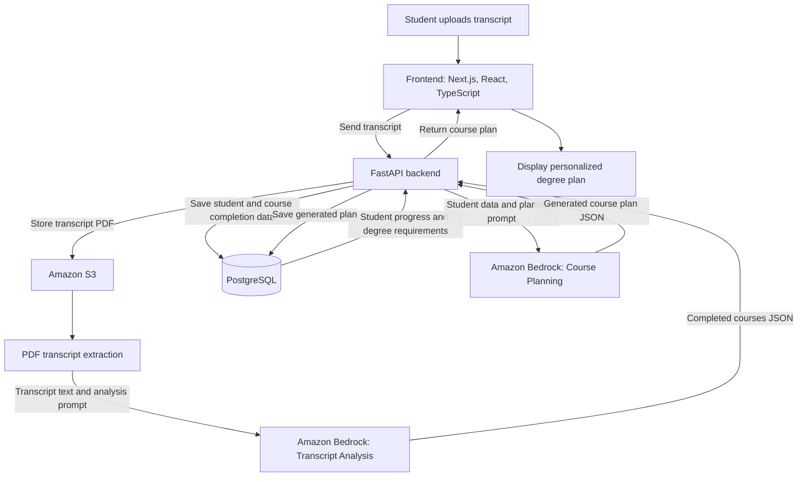

## Course Planning Assistant
Problem Statement: Built an AI chatbot to generate personalized course plans for students. Enforced strict rules for prerequisites, graduation requirements, etc using deterministic logic and LLM based reasoning. 

## Tech Stack and Architecture

- **Frontend:** Next.js, React, and TypeScript
  - Provides the user interface
  - Uploads transcripts and displays generated degree plans

- **Backend:** FastAPI and Python
  - Handles API requests
  - Extracts transcript data
  - Coordinates database, storage, and AI operations

- **Database:** PostgreSQL
  - Stores students, degree requirements, completed courses, and generated plans

- **File Storage:** Amazon S3
  - Stores uploaded transcript files

- **AI Service:** Amazon Bedrock
  - Converts transcript text into structured course data
  - Generates personalized degree plans

## System Architecture

