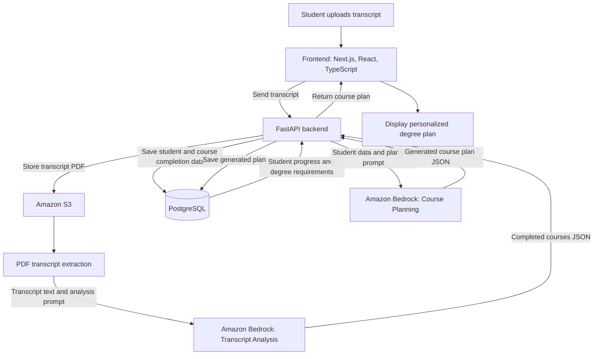

## Course Planning Assistant
Problem Statement: Built an AI chatbot to generate personalized course plans for students. Enforced strict rules for prerequisites, graduation requirements, etc using deterministic logic and LLM based reasoning. 

## System Architecture

